# Javelin Plugin for IntelliJ IDEA

**Turn test failures into a ranked list of suspicious code.**

Javelin analyzes which lines of code are executed by your failing tests versus your passing tests, then ranks every line by how suspicious it looks. Lines that are always hit by failing tests and rarely hit by passing tests rank highest. "The result: instead of reading through stack traces and stepping through a debugger, you get a ranked list grounded in test execution data, with every score fully traceable."

This technique is called **Spectrum-Based Fault Localization (SBFL)**. Javelin brings it into IntelliJ IDEA as a one-click workflow with in-editor highlighting.

 

  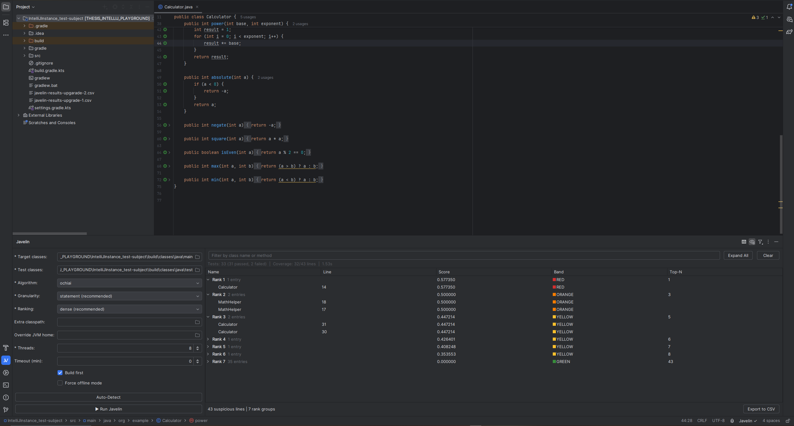

<em>Full IDE view: editor with suspicion band highlighting and gutter icons, configuration panel (bottom-left), ranked results (bottom-right), and completion notification</em>

 

---

## Requirements

 

| Requirement | Details |
|---|:---|
| **IntelliJ IDEA** | 2025.1 through 2025.3.x (Community or Ultimate) |
| **Java project** | Must be compiled (`.class` files present) with JUnit tests |
| **At least 1 failing test** | Javelin needs failing tests to identify suspicious code |

 

> **Note:** The plugin bundles its own analysis engine. You do **not** need a separate JDK 21 installation. The plugin runs using IntelliJ's bundled runtime, and your project can use **Java 8 or later** (tested on Java 8, 11, 17, and 21). See the [Java Compatibility Guide](javelin-plugin/docs/JAVA_COMPATIBILITY.md) for the full testing matrix and bytecode version details.

---

## Installation

Download the latest `javelin-plugin-0.1.2.zip` from the [Releases](https://github.com/DesmondQue/javelin-plugin-intellij/releases) page.

In IntelliJ IDEA, go to **Settings > Plugins > Gear icon > Install Plugin from Disk...**, select the `.zip` file, and restart the IDE when prompted.

> To build from source or run in development mode, see the [Build Guide](javelin-plugin/docs/BUILDING.md).

---

## Quick Start

1. **Compile your project:** `./gradlew classes testClasses` or `mvn compile test-compile -DskipTests`
2. **Open the Javelin tool window.** It appears at the bottom of the IDE after installation.
3. **Click Auto-Detect.** Javelin finds your compiled classes, test classes, and classpath automatically.
4. **Click Run Javelin Analysis** (or press `Ctrl+Shift+J`).
5. **Explore the results.** Double-click any row to jump to the suspicious line in your editor.

---

## Usage

### Configuration Panel

The left side of the Javelin tool window is the configuration panel, where you set up what Javelin should analyze.

 

  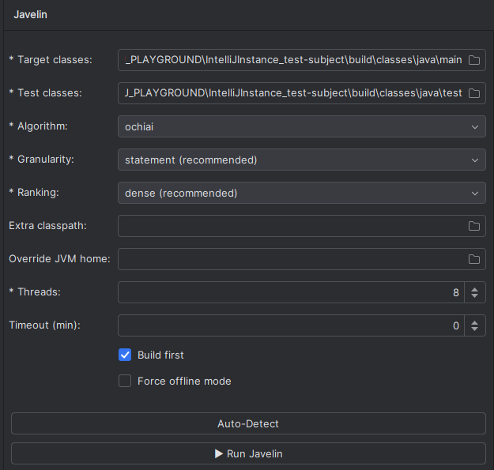

<em>Configuration panel with auto-detected paths and analysis settings</em>

 

Click **Auto-Detect** to automatically resolve paths for both Gradle and Maven project layouts. Fields marked with `*` are required. All detected paths can be overridden manually. Hover over any field label for a description of what it does.

 

  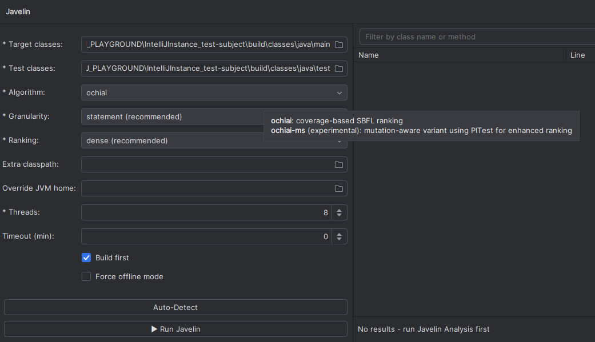

<em>Hovering over the Algorithm field shows a description of each option</em>

 

| Setting | Description |
|---|:---|
| **Target classes** | Compiled application classes directory |
| **Test classes** | Compiled test classes directory |
| **Source directory** | Java source root (only required for Ochiai-MS) |
| **Extra classpath** | Additional runtime dependencies your tests need |
| **Algorithm** | Choose between Ochiai (fast, default) and Ochiai-MS (slower, experimental). See [Choosing an Algorithm](#choosing-an-algorithm). |
| **Granularity** | `statement` ranks individual lines (default), `method` groups results by method |
| **Ranking** | `dense` for debugging (default), `average` for research evaluation. See [CLI docs](https://github.com/DesmondQue/javelin-cli/blob/main/docs/ALGORITHMS.md#ranking-strategies) for details. |
| **Timeout** | Maximum analysis time in minutes (0 = no limit) |
| **Threads** | Parallel test execution threads (defaults to CPU cores) |
| **JVM home** | Override the JVM used to run tests (defaults to the project SDK) |
| **Offline mode** | Use pre-instrumented bytecode instead of a Java agent (needed for projects using mockito-inline, bytebuddy-agent, etc.) |

 

---

### Running an Analysis

You can start an analysis from several places:

 

| Method | How |
|---|:---|
| **Configuration panel** | Click **Run Javelin Analysis** |
| **Keyboard shortcut** | `Ctrl+Shift+J` |
| **Menu** | `Tools > Run Javelin Analysis` |
| **Run Configuration** | `Run > Edit Configurations > + > Javelin` |

 

  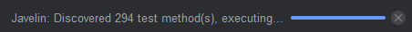

<em>Progress indicator while Javelin discovers and executes tests</em>

 

A notification appears when analysis completes, showing the number of suspicious lines found, the top-ranked result, and how long it took.

---

### Results Panel

The right side of the Javelin tool window displays results in a table grouped by rank.

 

  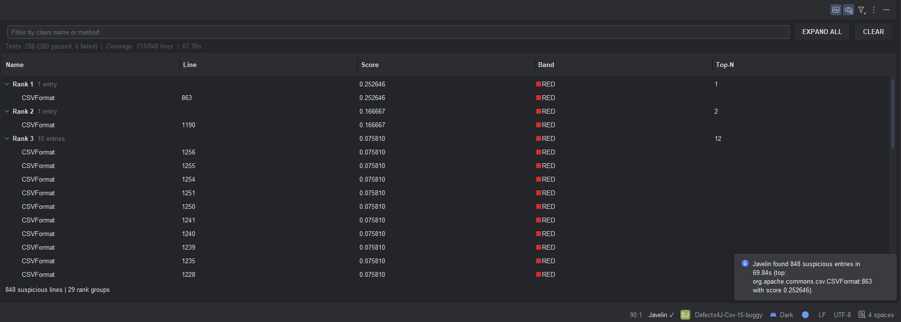

<em>Results grouped by rank with statistics bar and completion notification</em>

 

| Column | Description |
|---|:---|
| **Name** | Class name (statement-level) or `Class#method` (method-level) |
| **Line** | Source line number or line range |
| **Score** | Suspiciousness score from 0.0 (not suspicious) to 1.0 (most suspicious) |
| **Band** | Severity level: Critical, High, Medium, or Low |
| **Top-N** | Position in the overall ranked list |

 

Click any column header to sort. Use the filter field to search by class or method name. Right-click for copy and export options. The statistics bar at the bottom shows test counts (passed/failed), coverage metrics, execution timing, and mutation data when using Ochiai-MS.

Double-click a row (or press `Enter`) to navigate to that line in the editor. Hovering over a selected row shows its file path, line number, and score:

 

  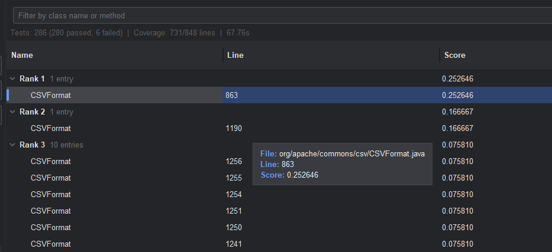

<em>Selecting a result row shows file, line, and score details</em>

 

The editor opens to the exact line, highlighted by suspicion band:

 

  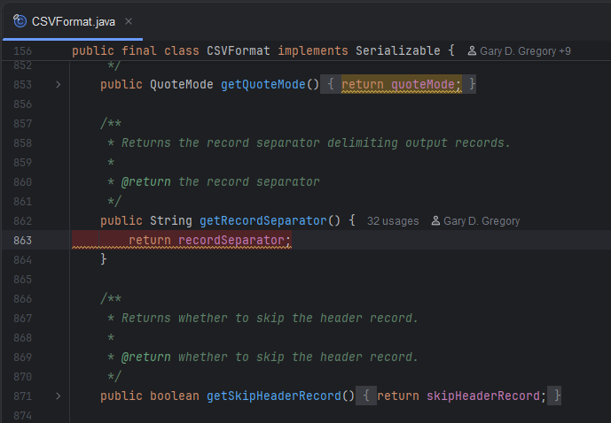

<em>Double-clicking navigates to the suspicious line in the editor</em>

 

---

### Visual Indicators

Javelin highlights suspicious lines directly in the editor using a 4-tier color scale so you can see risk at a glance while reading code.

Lines are colored by suspicion band, with gutter icons on the left and stripe marks on the scrollbar to the right:

 

  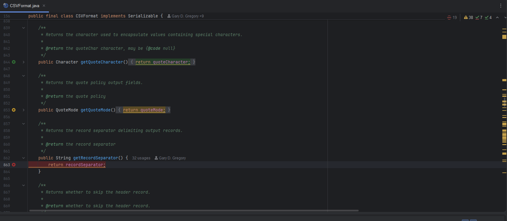

<em>Line highlighting, gutter icons, and scrollbar stripe marks in the editor</em>

 

| Band | Color | Meaning |
|---|---|:---|
| **Critical** | Red | Top 10% most suspicious |
| **High** | Orange | Top 25% most suspicious |
| **Medium** | Yellow | Remaining suspicious lines (score > 0) |
| **Low** | Green | Covered by tests but not implicated (score = 0) |

 

Hover over any highlighted line, gutter icon, or scrollbar mark to see its rank, score, and percentile. Each indicator type (line highlighting, gutter icons, scrollbar marks) can be toggled independently from the toolbar. Use the band filter dropdown to show or hide specific severity levels:

 

  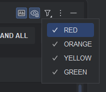

<em>Toggle individual severity bands from the toolbar dropdown</em>

 

**Works alongside other plugins.** Javelin's indicators use standard IntelliJ APIs and are designed to coexist with built-in features like breakpoints, error highlights, and search results. Gutter icons occupy a separate slot from run/debug markers. If a coverage plugin is active at the same time, its colors may blend with Javelin's. Toggle one off to keep results clear.

---

### Status Bar Widget

The widget in the bottom-right corner shows whether your project is ready for analysis.

Hover over the widget to see its status:

 

  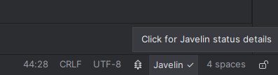

<em>Hovering shows a quick status message</em>

 

Click the widget to see a readiness checklist showing whether your project has everything Javelin needs: Java module detected, classes compiled, JDK available, and engine bundled.

| Icon | Meaning |
|---|:---|
| **Javelin checkmark** | Ready to run |
| **Javelin !** | Some checks failing |
| **Javelin dash** | Not ready |
| **Javelin spinner** | Analysis in progress |

 

  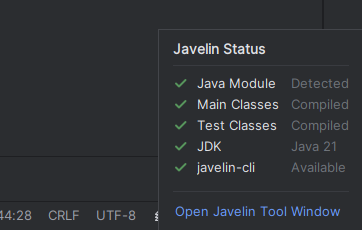

<em> On click readiness checklist with per-component status</em>

 

 

---

### Settings and Clearing Results

**Persistent settings.** Go to **Settings > Tools > Javelin** to configure defaults that persist across sessions, including algorithm, granularity, thread count, and which visual indicators are enabled.

 

  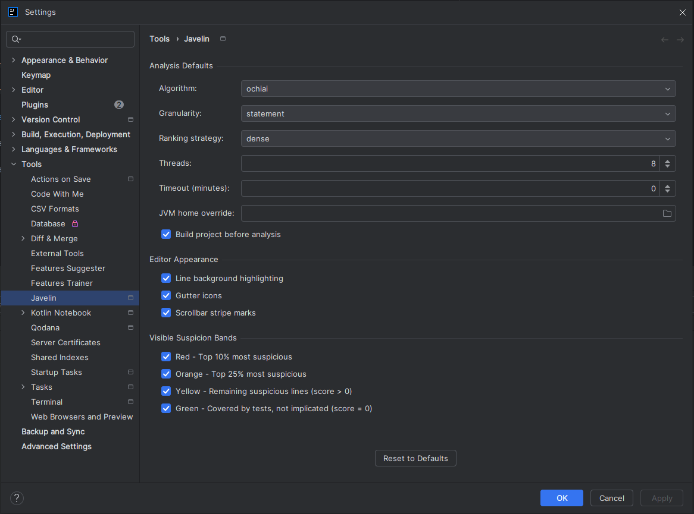

<em>Settings > Tools > Javelin with analysis defaults and editor appearance options</em>

 

**Clearing results.** Go to **Tools > Clear Javelin Results** to remove all highlights, gutter icons, scrollbar marks, and result data from the editor.

---

## Choosing an Algorithm

Javelin offers two analysis modes. Both analyze the same test and coverage data, but they differ in how they score suspiciousness.

### Ochiai (default)

Uses test pass/fail outcomes and code coverage to rank lines. Fast, reliable, and sufficient for most debugging scenarios. This is the standard algorithm used in fault localization research.

**When to use:** Start here. It runs in seconds to minutes depending on project size and gives good results for most bugs.

### Ochiai-MS (experimental)

Extends Ochiai by running mutation testing ([PITest](https://pitest.org/)) on the suspicious region, then adjusting scores based on how effectively each test kills mutants. This can improve precision for certain fault types but takes significantly longer.

**When to use:** When Ochiai's results are inconclusive and you want to try a more thorough analysis. Requires a source directory. Expect analysis times of minutes to hours depending on project size.

> **Experimental:** Ochiai-MS is a research contribution under active evaluation. Results and behavior may change in future releases.

For the mathematical formulas and implementation details behind both algorithms, see the [Algorithm Documentation](https://github.com/DesmondQue/javelin-cli/blob/main/docs/ALGORITHMS.md) in the javelin-cli repository.

---

## Known Limitations

**Project must be compiled first.** Javelin analyzes `.class` files, not source code. Run your build before analysis: `./gradlew classes testClasses` or `mvn compile test-compile -DskipTests`.

**Build-tool orchestrated tests.** Tests requiring the build tool to manage infrastructure (e.g., Arquillian server lifecycle, Maven Failsafe phase orchestration) are not supported. Standard unit tests, Spring Boot `@SpringBootTest`, and Testcontainers tests all work.

**Overlapping coverage highlights.** If IntelliJ's built-in coverage runner (or a third-party coverage plugin) is active at the same time, both tools highlight lines in the editor and their colors blend. Disable one tool's highlighting before running the other, or toggle Javelin's indicators from the toolbar.

**JVM differences with older projects.** The plugin runs tests on the project SDK (Java 11+) or IntelliJ's bundled runtime (Java 21) as a fallback. Projects targeting Java 7 and below may encounter runtime differences. Use the **JVM home** field to specify a matching JDK. See the [JVM Compatibility](https://github.com/DesmondQue/javelin-cli#jvm-compatibility) docs for details.

---

## Documentation

| Document | Description |
|---|:---|
| [Build Guide](javelin-plugin/docs/BUILDING.md) | Build from source, run in development mode, run tests |
| [Architecture](javelin-plugin/docs/ARCHITECTURE.md) | System architecture, data flow, and design decisions |
| [Java Compatibility](javelin-plugin/docs/JAVA_COMPATIBILITY.md) | Testing matrix, bytecode versions, and JVM selection |
| [Algorithm Documentation](https://github.com/DesmondQue/javelin-cli/blob/main/docs/ALGORITHMS.md) | Ochiai and Ochiai-MS formulas, ranking strategies, method aggregation |
| [CLI Troubleshooting](https://github.com/DesmondQue/javelin-cli/tree/main/javelin-core/docs) | Offline mode, output format, common issues |

---

## Related

| Project | Description |
|---|:---|
| [javelin-cli](https://github.com/DesmondQue/javelin-cli) | Command-line SBFL tool (standalone, Homebrew/Scoop installable) |

---

## License

[MIT License](LICENSE)
